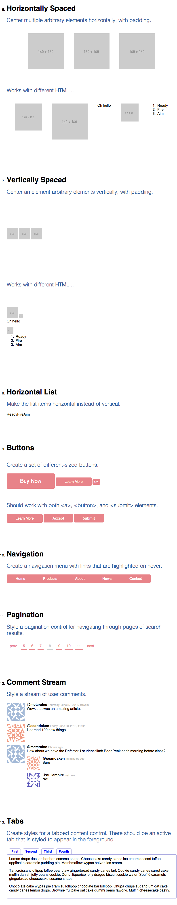

# CSS Modularity 2:

## Requirements

1. Write the CSS necessary to render the following components, following the instructions in Part I. Use the given starter [code](https://github.com/RefactorU/refactoru-exercise-starters/tree/master/css/modularity2). *Important: Do not modify the HTML other than to add ids and classes.*
	- horizontally spaced
	- vertically spaced
	- horizontal list
	- buttons
	- navigation
	- pagination
	- comment stream
	- tabs

Style the given HTML to match the following screenshot. It doesn't need to be pixel perfect (just eyeball it) but it should be close, with color, font, layout, and spacing properly accounted for.

